# Physically Based Rendering in Rust

The motivation is to explore the algorithms outlined in the
[book](http://www.pbr-book.org/) while simultaneously learning a new language
like Rust.

## Releases

Completed work from the book will be tagged as a release which can be found
[here](https://github.com/hackmad/pbr_rust/releases).

## Renders

Some scenes include PBRT files from:
- [Scenes for pbrt-v3](https://www.pbrt.org/scenes-v3) under `../pbrt-v3-scenes` 
  relative to this repositories root. 
- [Vripped reconstruction of Dragon Model](http://graphics.stanford.edu/data/3Dscanrep/) 
  under `../dragon_recon` relative to this repositories root. 

The relative paths for `Texture`, `Include` etc are relative to the scene file location.

PNG files can be compressed using `pngquant`:
```bash
pngquant --ext .png --force renders/shapes/sphere.png
```
OR
```bash
pngquant --ext .png --force renders/shapes/*.png 
```

### Shapes

<a title="Sphere" href="renders/shapes/sphere.png"></a>
<a title="Cyinder" href="renders/shapes/cylinder.png"></a>
<a title="Disk" href="renders/shapes/disk.png"></a>
<a title="Other Quadrics" href="renders/shapes/other-quadrics.png"></a>
<a title="PLY Mesh" href="renders/shapes/plymesh.png"></a>
<a title="Loop Subdivision Surface" href="renders/shapes/loopsubdiv.png"></a>
<a title="All Shapes" href="renders/shapes/all-shapes.png"></a>
<a title="Triangles Alpha Mask" href="renders/shapes/triangles-alpha-mask.png">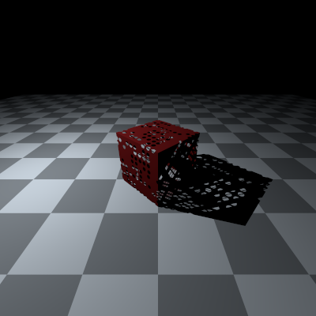</a>

### Textures

<a title="2D Mappings" href="renders/textures/2d-mappings.png"></a>
<a title="UV" href="renders/textures/uv.png"></a>
<a title="2D Checkerboard" href="renders/textures/2d-checkerboard.png"></a>
<a title="Dots" href="renders/textures/dots.png"></a>
<a title="Wrinkled" href="renders/textures/wrinkled.png">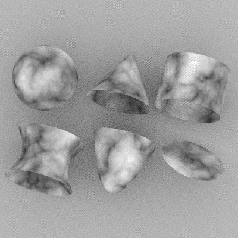</a>
<a title="Windy" href="renders/textures/windy.png">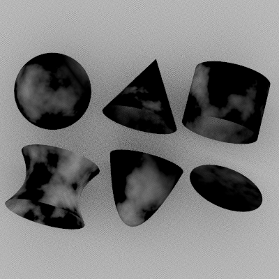</a>
<a title="fBm" href="renders/textures/fbm.png">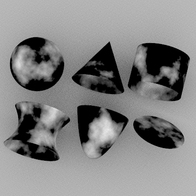</a>
<a title="Marble" href="renders/textures/marble.png">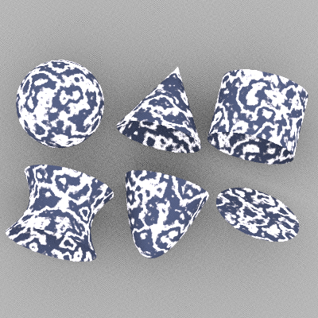</a>
<a title="Bilerp" href="renders/textures/bilerp.png">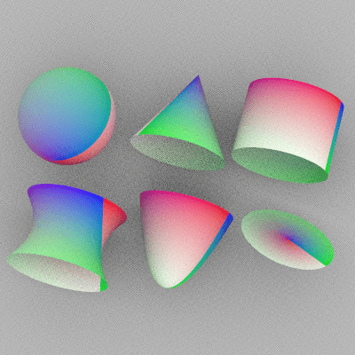</a>
<a title="Constant" href="renders/textures/constant.png">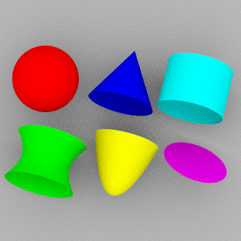</a>
<a title="Mix" href="renders/textures/mix.png">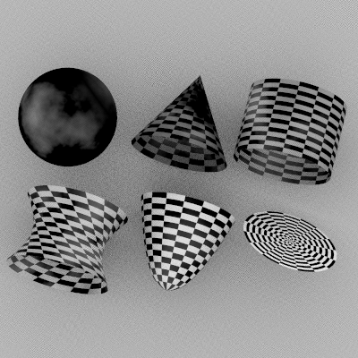</a>
<a title="Scale" href="renders/textures/scale.png">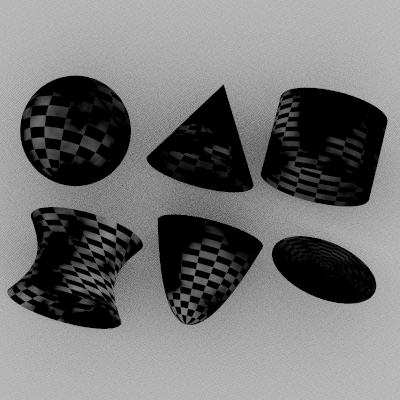</a>
<a title="3D Checkerboard" href="renders/textures/3d-checkerboard.png"></a>
<a title="Trilinear Filtering" href="renders/textures/trilinear-filtering.png"></a>
<a title="EWA Filtering" href="renders/textures/ewa-filtering.png"></a>

### Materials

<a title="Matte" href="renders/materials/matte.png">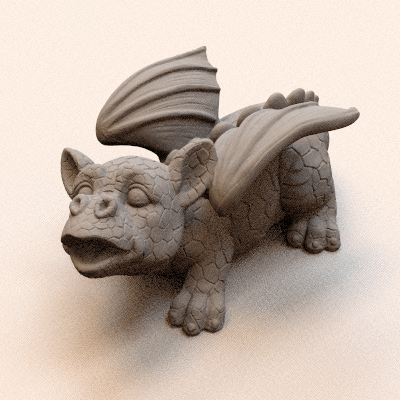</a>
<a title="Glass" href="renders/materials/glass.png">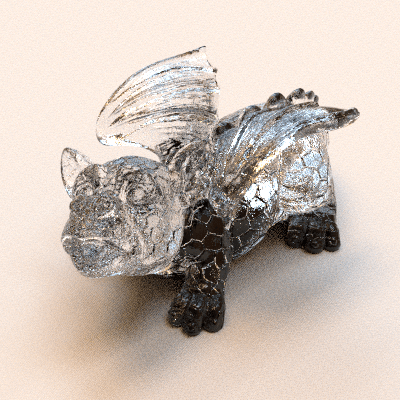</a>
<a title="Plastic" href="renders/materials/plastic.png">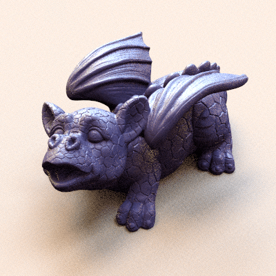</a>
<a title="Fourier" href="renders/materials/fourier.png">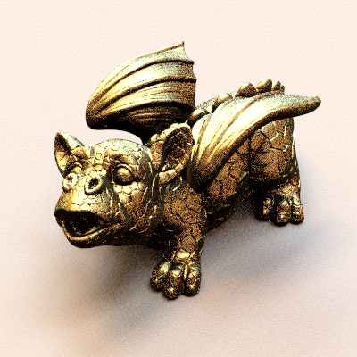</a>
<a title="Mirror" href="renders/materials/mirror.png">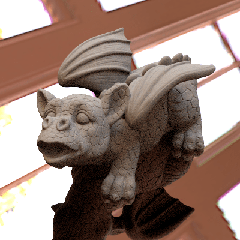</a>
<a title="Uber" href="renders/materials/uber.png">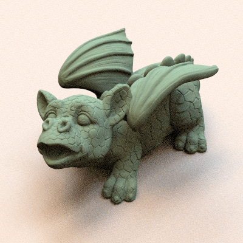</a>
<a title="Metal" href="renders/materials/metal.png">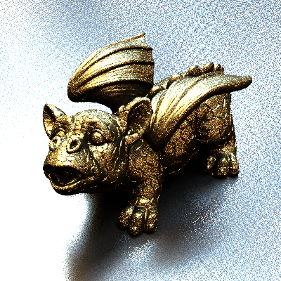</a>
<a title="Translucent" href="renders/materials/translucent.png">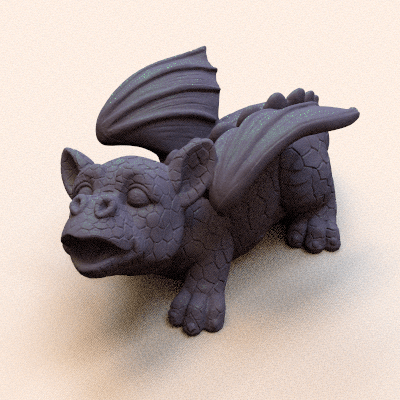</a>
<a title="Substrate" href="renders/materials/substrate.png">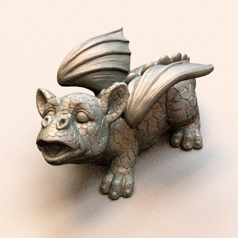</a>
<a title="Bump Map" href="renders/materials/bump.png">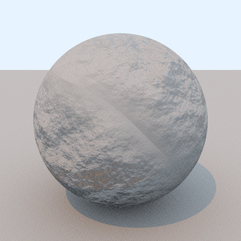</a>
<a title="Subsurface" href="renders/materials/subsurface.png">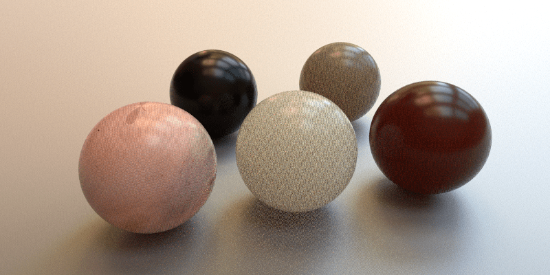</a>

### Media

<a title="Grid Density" href="renders/media/smoke.png">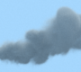</a>

### Cameras

<a title="Perspective" href="renders/cameras/perspective.png">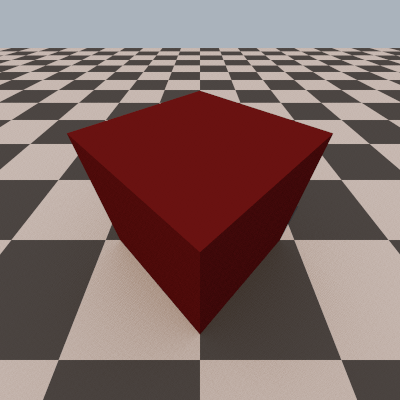</a>
<a title="Orthographic" href="renders/cameras/orthographic.png">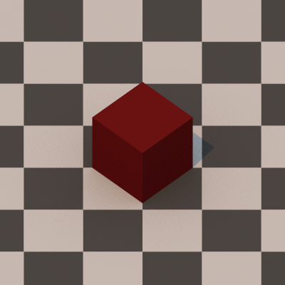</a>
<a title="Realistic" href="renders/cameras/realistic.png">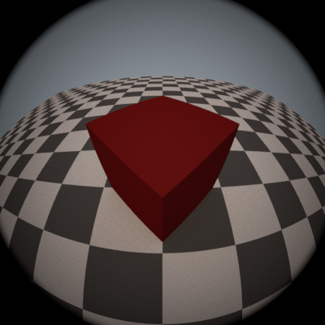</a>
<a title="Environment" href="renders/cameras/environment.png">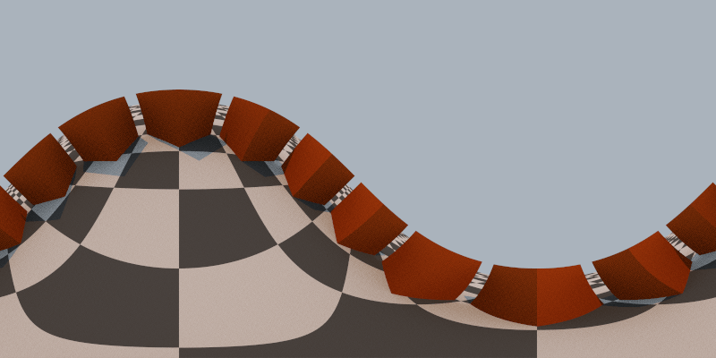</a>
<a title="Depth of field" href="renders/cameras/depth-of-field.png">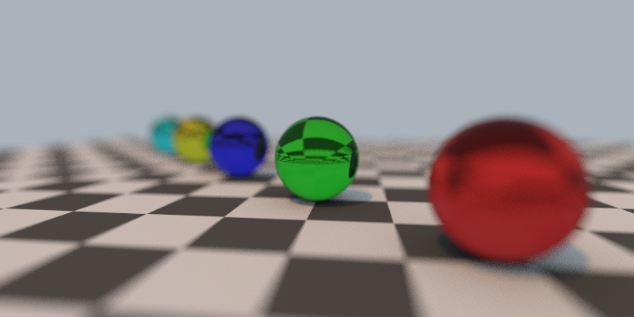</a>

### Lights

<a title="Point" href="renders/lights/point.png">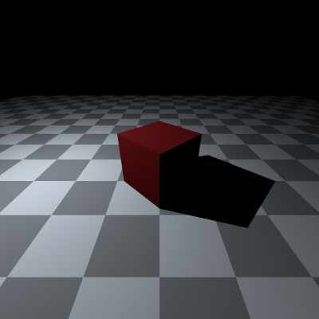</a>
<a title="Diffuse" href="renders/lights/diffuse.png"></a>
<a title="Distant" href="renders/lights/distant.png">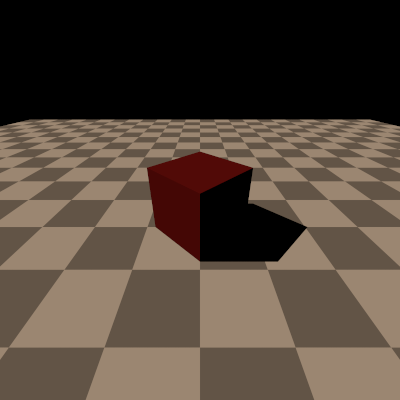</a>
<a title="Infinite No Map" href="renders/lights/infinite-no-map.png">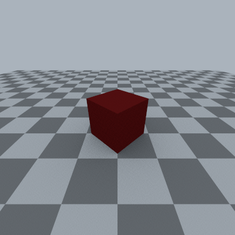</a>
<a title="Infinite With Map" href="renders/lights/infinite-with-map.png">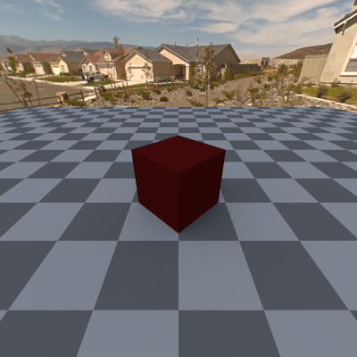</a>
<a title="Spot" href="renders/lights/spot.png">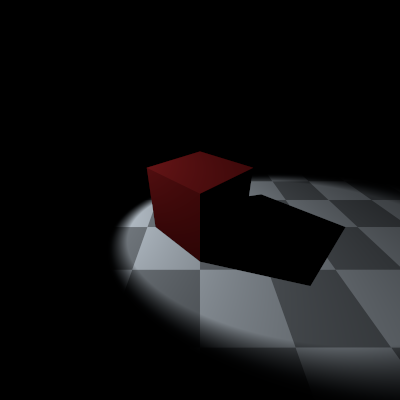</a>
<a title="Projection" href="renders/lights/projection.png">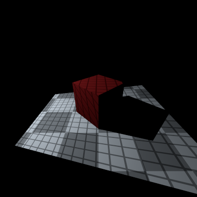</a>
<a title="Goniophotometric" href="renders/lights/goniometric.png">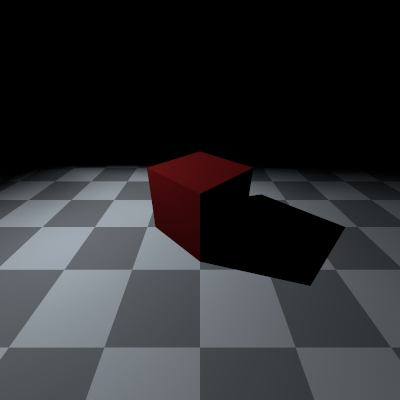</a>

### Samplers

<a title="(0-2) Sequence" href="renders/samplers/02sequence.png">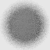</a>
<a title="Halton" href="renders/samplers/halton.png">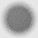</a>
<a title="Maximized Minimal Distance" href="renders/samplers/maxmindist.png">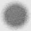</a>
<a title="Random" href="renders/samplers/random.png">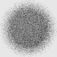</a>
<a title="Stratified" href="renders/samplers/stratified.png">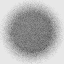</a>

### Transforms

<a title="Animation" href="renders/transforms/anim-bluespheres.png">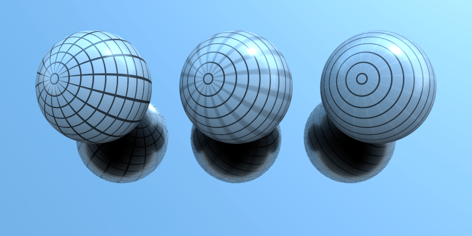</a>

### Object Instancing

<a title="Instances" href="renders/objects/instances.png">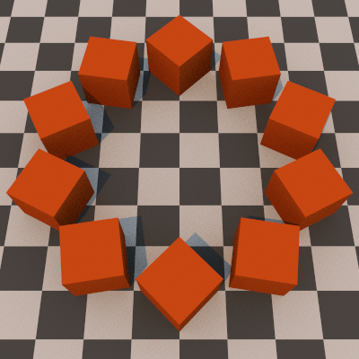</a>

### Integrators

<a title="SPPM 10 iterations caustic-glass" href="renders/integrators/sppm/f16-9a.png"></a>
<a title="SPPM 100 iterations caustic-glass" href="renders/integrators/sppm/f16-9b.png">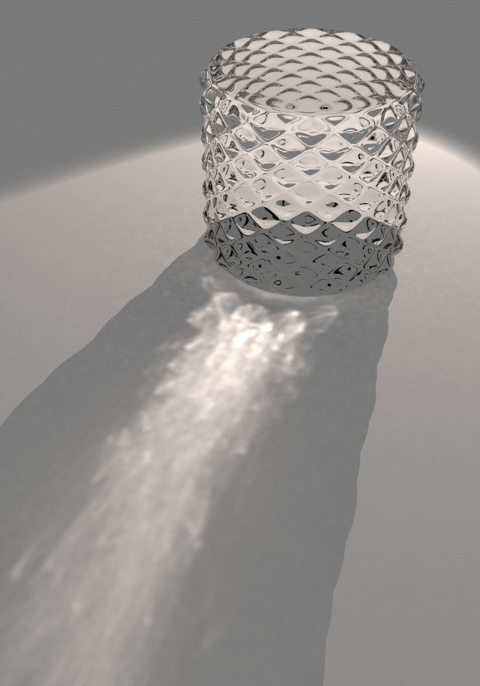</a>

## Building

Build debug profile. The executable will be `target/debug/pbr_rust`.
```bash
cargo build
```

Use `--release` when building/running for faster executable. The executable
will be `target/release/pbr-rust`.
```bash
cargo build --release
```

## Testing

Not everything will be unit tested. The goal was to learn about different
techniques used in Rust for unit testing, property based testing and debugging.

The unit tests can be run as follows:
```bash
cargo test
```

## Running

This section will be updated as new features get added while progressing
through the book.

The debug version can be run as:
```bash
cargo run -- [OPTIONS] <FILE1> <FILE2> ...
```

The release version can be run as:
```bash
cargo run --release -- [OPTIONS] <FILE1> <FILE2> ...
```

To run the compiled binary directly use:
```bash
./target/release/pbr-rust [OPTIONS] <FILE1> <FILE2> ...
```

To run all scenes:
```bash
cargo run --release -- [OPTIONS] <FILE1> <FILE2> ...
```
```bash
./target/releases/pbr-rust [OPTIONS] $(find scenes | grep -v geometry | grep "\.pbrt$")
```

To run examples from `../pbrt-v3-scenes` you can use relative paths to point to the binary. For example, the example in `../pbrt-v3-scenes/caustic-glass` can be rendered like this:
```bash
cd ../pbrt-v3-scenes/caustic-glass

../../pbr_rust/target/release/pbr-rust -t 4 f16-9a.pbrt
```

## Profiling / Performance

### DHAT

Use `--features dhat-rs` to get heap profiling stats. Note that this will be a
lot slower to run.
```bash
cargo run --release --features dhat-rs -- [OPTIONS] <FILE1> <FILE2> ...
```

This will generate a file `dhat-heap.json` which can be viewed using the DHAT
viewer. There is an [online tool](https://nnethercote.github.io/dh_view/dh_view.html) 
available as well.

### Jemalloc

Use `--features jemalloc` to use jemalloc on Linux/MacOS. On Windows, it will 
use default global allocator. This is mutually exclusive with `dhat-rs` feature.
```bash
cargo run --release --features jemalloc -- [OPTIONS] <FILE1> <FILE2> ...
```

### Profile guided optimization

See [profile guided optimization](https://doc.rust-lang.org/rustc/profile-guided-optimization.html#a-complete-cargo-workflow).

__NOTE:__ Use of `asdf` is not symlinking toolchain components. Hence the export.

```bash
# STEP 0: Make sure there is no left-over profiling data from previous runs
rm -rf /tmp/pgo-data

export PATH=~/.asdf/installs/rust/1.57.0/toolchains/1.57.0-x86_64-apple-darwin/lib/rustlib/x86_64-apple-darwin/bin/:$PATH

# STEP 1: Build the instrumented binaries
RUSTFLAGS="-Cprofile-generate=/tmp/pgo-data" cargo build --release --target=x86_64-apple-darwin

# STEP 2: Run the instrumented binaries with some typical data
./target/x86_64-apple-darwin/release/pbr-rust scene1.pbrt
./target/x86_64-apple-darwin/release/pbr-rust scene2.pbrt

# STEP 3: Merge the `.profraw` files into a `.profdata` file
llvm-profdata merge -o /tmp/pgo-data/merged.profdata /tmp/pgo-data

# STEP 4: Use the `.profdata` file for guiding optimizations
RUSTFLAGS="-Cprofile-use=/tmp/pgo-data/merged.profdata" \
    cargo build --release --target=x86_64-apple-darwin
```

### Flamegraph
```bash
cargo install flamegraph
```

On MacOS DTrace needs root permissions!
```bash
sudo cargo flamegraph --dev -- target/release/pbr-rust scene.pbrt
```

Ignore this error if you see `cargo-flamegraph.stacks`.
```bash
[2021-12-25T21:36:44Z ERROR pbr_rust] Error reading file 'target/release/pbr-rust': stream did not contain valid UTF-8
```

The result should be in `flamegraph.svg`.
